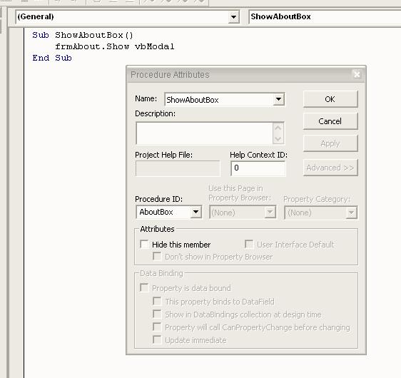



## Creating Aboutbox in UserControl

### Description

This article show how you can do custom AboutBox in custom control (usercontrol).
 
### More Info
 

             |
---                |---
**Submitted On**   |
**By**             |[vViktor](https://github.com/Planet-Source-Code/PSCIndex/blob/master/ByAuthor/vviktor.md)
**Level**          |Beginner
**User Rating**    |4.7 (14 globes from 3 users)
**Compatibility**  |VB 6\.0
**Category**       |[Custom Controls/ Forms/  Menus](https://github.com/Planet-Source-Code/PSCIndex/blob/master/ByCategory/custom-controls-forms-menus__1-4.md)
**World**          |[Visual Basic](https://github.com/Planet-Source-Code/PSCIndex/blob/master/ByWorld/visual-basic.md)
**Archive File**   |

### Source Code

First, add new form to you control and name it "frmAbout". Project the form and in UserControl code add this procedure: 
 <b>Sub ShowAboutBox() 
   frmAbout.Show vbModal 
End Sub</b>  
Then click in upper VB menu Tools -> Procedure Attributes.... Select "ShowAboutBox" in name combo and click "Advanced >>" button. Next you must select AboutBox in ProcedureID and click OK. It's all.

